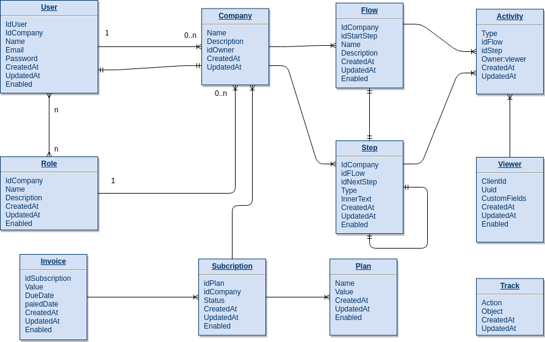

# Objetivo
Criar uma api em node.js 

# Requisitos
- Criar database: [Imagem 1](#image1)
- Criar Controllers com segurança.

#### Company
- Permitir criar e editar.
    - Nome é obrigatório.
    - Dono é obrigatório.

#### User
- Permitir criar, editar e raemover.
    - Nome é obrigatório.
    - Empresa é obrigatório.
    - Email é obrigatório.
    - Senha é obrigatório.
- Se for dono de uma empresa não pode ser removido. 
- Deve permitir vincular uma lista de Role, vinculadas a sua empresa.

#### Role
- Permitir criar, editar e remover roles da sua empresa.
    - Nome é obrigatório.
    - Empresa é obrigatório.

#### Flow
- Permitir criar, editar e remover.
    - Empresa é obrigatório.
    - Nome é obrigatório.
- Salvar o id do primeiro Step.

#### Steps
- Permitir Criar steps do tipo: ['popover', 'modal', 'hotspot', 'video', 'notification']
- Deve ser vinculado para uma empresa e flow.
- Sempre que criar um step deve preencher o id desse step no ultimo step da lista.
    - Empresa é obrigatório.
    - Flow é obrigatório.
    - Tipo é obrigatório.
    - Texto Interno é obrigatório.

#### Activity 
- Permitir criar.
    - Tipo é obrigatório.
    - Flow ou Step é obrigatório.
    - Dono é obrigatório.
- Tipos: ['StartFlow', 'EndFlow', 'CancelFlow', 'StartStep','EndStep', 'CancelStep']

#### Viewer
- Permitir criar e editar.
- Client id pode ser informado pelo cliente como identificador unico.
- Uuid deve ser gerado sempre para um novo Viewer sem client id.

#### Track
- Permitir Criar.
    - Action é obrigatório.
    - Object é obrigatório.
- Tipos de Action: ['Create', 'Edit', 'Remove']
- Object que foi alterado: ['Company', 'Role', 'FLow', 'Step', 'User']

#### Plan
- Existem 3 planos na base:
    - Basic: com valor de 250.
    - Pro: com valor de 500.
    - Enterprise: com valor de 500.

#### Subscription
- Quando criar uma empresa ja deve criar uma assinatura.
    - Empresa é obrigatório.
    - Plano é obrigatório.
    - Status é obrigatório.
- Statues: ['trial', 'active', 'pastDue', 'blocked']
- Due Date: Dia que deve gerar uma cobrança.

#### Invoice
- Data de vencimento vem da Subscription.
- Valor vem do plano.
    - Plano é obrigatório.
    - Data de vencimento é obrigatório.
    - Valor é obrigatório.

# Bonus
- Criação de testes (Biblioteca fica a seu critério)
- Documentação (apidocjs ou outra biblioteca)
- Monitoramento de uso da api.
- Consumidor da api (Postman, front-end)

# O que iremos avaliar
- Stack utilizada, nós usamos: Express, Mongoose, Sequelize, Mocha, Chai, Jsonwebtoken.
- Qualidade do código (semântico, legibilidade, modular, etc)

------

## Imagem 1

   
